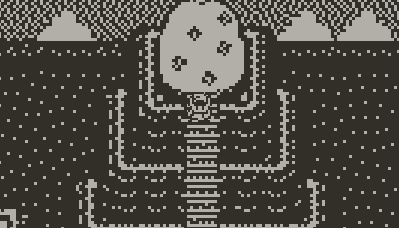
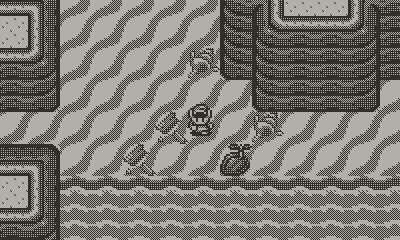
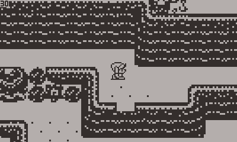
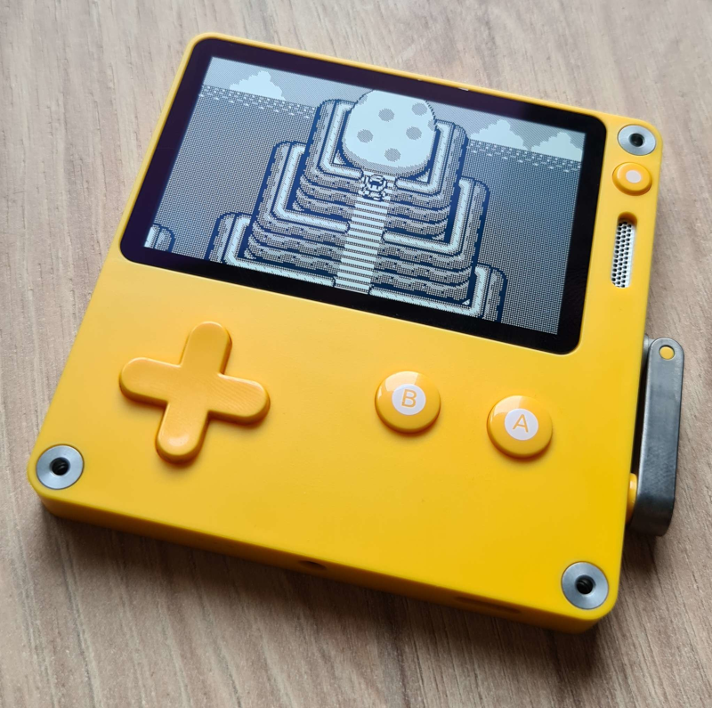

# Link's Awakening Overworld (Demo) for Playdate 

## First things first
This code was provided unter the [MIT License](LICENSE). If you implement this code into one of your projects, then please credit me in some way.

This is a Fan Project and not related to Nintendo in any way. Please support the [official release](https://www.nintendo.com/store/products/the-legend-of-zelda-links-awakening-switch/)!

## Download / Install
You can download the pdx of this project to sideload [here](Links-Awakening-Overworld-Download.zip).

A guide on how to sideload this game can be found [here](https://help.play.date/games/sideloading/).

## The project
This is a demo of a static verison of Link's Awakenings overworld running on the playdate.

Walk with the D-Pad and sprint using the B-Button.

There are currently no collisions, so you can just walk around the world and enjoy it without boundaries.

This demo works with a variable framerate and solid 49 fps on device. By replacing the images under source/images/assets you could also get Pokémon Red/Blue/Yellows map or any other games map running.

## Assets and tools used:

- [Song used made by The Accordion Guy](https://www.youtube.com/watch?v=Xp6UEZFfPbs)
- [Source of the map provided by Donut Jacky on Pintrest](https://www.pinterest.ch/pin/798896421383750450/)
- [Link Sprites provided by 
ProfessorCreepyPasta on deviantart](https://www.deviantart.com/professorcreepypasta/art/Link-s-Awakening-Link-Sprites-for-RPG-Maker-MV-826890016)
- [AnimatedSprite by Whitebrim
](https://github.com/Whitebrim/AnimatedSprite/wiki)
- [VSCode-PlaydateTemplate by Whitebrim](https://github.com/Whitebrim/VSCode-PlaydateTemplate)
- [Dithering of the map using Ditherlicious](https://29a.ch/ditherlicious/)

## Collaborations
If you wanna continue developing this, then hit me up on [Twitter @PizzaFuelDev](https://twitter.com/PizzaFuelDev) or on the Playdate Squad Discord.

